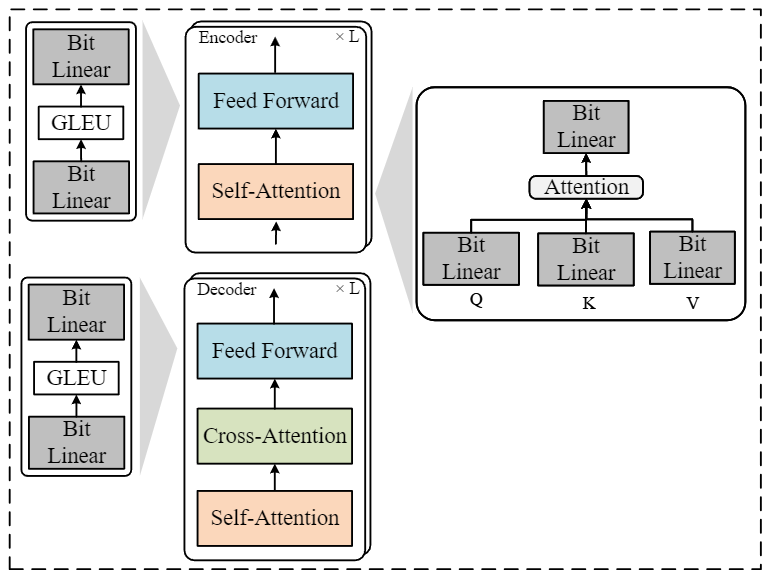
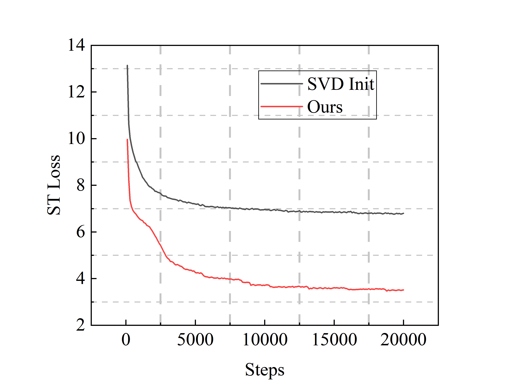

<h2 align="center">
Sign Value Constraint Decomposition for Efficient 1-Bit Quantization of Speech Translation Tasks
</h2>

<p align="center">
  <!--  -->
  <!-- <under review></a> -->
  
  
</p>

<p align="center">
(Under review).
After the review period, we will open-source the code on our GitHub.
</p>

### Overview

<div style="text-align: center">

</div>

### SVCD Linear

<div style="text-align: center">

</div>

### Key Implementation Details


- Step 1, the input ***x*** is multiplied by the ***g*** vector (Hadamard product) `cress_bitnet\models\bit_linear.py Line 127`;
- Step 2, Perform linear transformation `cress_bitnet\models\bit_linear.py Line 132`;
- Step 3, Quantize activations `cress_bitnet\models\bit_linear.py Line 135`;
- Step 4 Generate Outputs (the output ***z*** is multiplied by the ***h*** vector) `cress_bitnet\models\bit_linear.py Line 137 `;


### More Analysis


#### Submodule Performance in Decoder Cross-Attention


We further investigate the quantization effects of the cross-attention sub-modules in the decoder module. We quantify the decoder's cross-attention module's query, key, value, and output linear layers. The experimental results, as shown in the table below, indicate that all sub-modules significantly impact the model's performance. Among them, the value and output linear layers have a more significant impact than the query and key linear layers.


<style>
.center 
{
  width: auto;
  display: table;
  margin-left: auto;
  margin-right: auto;
}
</style>

<p align="center"><font face="黑体" size=2.></font></p>

<div class="center">

|       |     |       |     | En-De | En-Ro |
|:-----:|:---:|:-----:|:---:|:-----:|:-----:|
| Query Linear| Key Linear | Value Linear | Out Linear |   -   |   -   |
|  &#x2714;     |     |       |     |  6.78 |  7.33 |
|       |  &#x2714;   |       |     |  9.84 |  9.14 |
|       |     |      &#x2714;  |    |  0.0  |  0.10 |
|       |     |       |    &#x2714; |  0.40 |  0.04 |

</div>


#### Comparsion of SVCD Constraint
We compare model initialization using constraints and without constraints and present the experimental results (see Figure). When the initialization method without constraints is used, the model is prone to stopping training due to excessive gradient leakage in the FP16 training mode.

<div style="text-align: center">

</div>


#### Why not use the Bitnet linear layer?
Bitnet quantizes the weight matrix without adding two additional parameter matrices. However, Bitnet cannot be trained with fp16 due to gradient leakage.

#### Why add the "Constraint" to SVCD？ 
If the two additional trainable parameter vectors are not constrained, the model will still also experience gradient leakage during the first round of training when trained with FP16.


#### Comparsion of SVCD and SVD Initialization
For the two additional trainable vectors, ***g*** and ***h***, we compare our method with the SVD initialization. In the SVD initialization method, we decompose the weight matrix **W** of the linear layer into matrices **U** and **V**. Then, we select rank-1 vectors from each matrix for initializing ***g*** and ***h***, respectively. As shown in the experimental results in the figure, the loss using the SVD initialization method is significantly higher than with our method, indicating that the SVD initialization method does not achieve the expected effect.

<div style="text-align: center">

</div>

Core Code of SVD Implementation
```
# rank = 1
U, S, VT = svd(self.numpy_weight)
U = torch.from_numpy(U)
VT = torch.from_numpy(VT)
U_rank_1_approximation = U[:, 0] # g
Vt_rank_1_approximation = VT[0, :] # h
```

#### Core Codes

Forward Function
```
# x: (sequence_length, batch, features_embedding) 

    def forward(self, x: Tensor) -> Tensor:
        """
        Forward pass of the BitLinear layer.
        Args:
            x (Tensor): Input tensor.
        Returns:
            Tensor: Output tensor.
        """
        # Normalize input
        x = self.norm(x)
        x = x * self.g

        # Binarize weights and quantize activations
        binarized_weights = self.binarize_weights_groupwise()

        # Perform linear transformation
        output = torch.nn.functional.linear(x, binarized_weights, self.bias)

        # Quantize activations
        output = self.quantize_activations_groupwise(output)
        output = output * self.h
        
        return output
```

Constraint Initialization Function

```
    def __init__(
        self,
        in_features: int,
        out_features: int,
        bias: bool = True,
        num_groups: int = 1,
    ):
        super().__init__(in_features, out_features, bias)
        self.num_groups = num_groups
        self.eps = 1e-5
        self.norm = nn.LayerNorm(in_features)
        
        self.g = nn.Parameter(torch.Tensor(in_features))
        self.h = nn.Parameter(torch.Tensor(out_features))    # in_features     out_features
        
        fan_in, _ = torch.nn.init._calculate_fan_in_and_fan_out(self.weight)
        bound = 1 / math.sqrt(fan_in)
        torch.nn.init.uniform_(self.g, -bound, bound)
        torch.nn.init.uniform_(self.h, -bound, bound)
```

### Installations

Create a conda environment with Pytorch and install fairseq

```
conda create --name pruning python=3.9
conda activate bitnet
git clone https://github.com/pytorch/fairseq
cd fairseq
pip install --editable ./
python setup.py build develop

# if you meet the following error, please reinstall the packages

# generation error: sacrebleu import error TOKENIZER 
pip install sacrebleu==1.5.1

# numpy np.float error 
pip install numpy==1.23.5
```


This repository is based on [fairseq](https://github.com/facebookresearch/fairseq). If you require information on the basic usage of fairseq, please refer to the [fairseq documentation](https://fairseq.readthedocs.io/en/latest/).

Requirements
- pandas==2.0.3
- sacrebleu==1.5.1
- scikit-learn==1.3.0
- scipy==1.11.1
- sentencepiece==0.1.99
- tensorboard==2.14.0
- torch==2.0.1
- torchaudio==2.0.2
- tqdm==4.65.0


### Datasets and Models
#### MuST-C Datasets Prepare

Please Download [MuST-C-v1](https://docs.google.com/forms/d/e/1FAIpQLSer9jNfUtxbi610n3T6diXRlANBbuzShsCje-GtKs1Sngh0YQ/viewform?pli=1) datasets. 

   *Notes: It appears that the original dataset [website](https://www.fbk.eu/en/research-centers/) hides the download link. However, the dataset can still be downloaded after filling out the dataset request [form](https://docs.google.com/forms/d/e/1FAIpQLSer9jNfUtxbi610n3T6diXRlANBbuzShsCje-GtKs1Sngh0YQ/viewform?pli=1) directly. So we recommend that you use this method.*

1. Make directories to store ST (MuST-C) and datasets. Please specify the target language.

2.  Preprocess spm data. 

#### Speech Pre-trained Model 

We use HuBERT model for speech pre-trained model for training. Before training, please download the [HuBERT-Base](https://dl.fbaipublicfiles.com/hubert/hubert_base_ls960.pt) model.


#### Machine Translation Pre-trained Model

We use Deltalm-base model for machine translation pre-trained model. Please download the [Deltalm-Base](https://deltalm.blob.core.windows.net/deltalm/deltalm-base.pt).


#### Speech-to-text Translation Training

#### Regular Training Baselines
```
export CUDA_VISIBLE_DEVICES=1
target=de
SAVE_DIR=/workspace/s2t/deltalm_data/save_dir/$target/model_baselines

data_dir=/workspace/s2t/data/en_de
# TEXT_DIR=/workspace/s2t/deltalm_data/en-$target/binary
TEXT_DIR=/workspace/s2t/npy_st/mt_data_bin/en-$target/en-$target/binary
USER_DIR=/workspace/tome/npy_tome_test

HU_BERT=/workspace/s2t/npy_st/pretrained_model_save/hubert/hubert_base_ls960.pt
MT_PRETRAINED_MODEL=/workspace/s2t/npy_st/pretrained_model_save/mt_model_save/mt.en-de.base.pt

fairseq-train $data_dir --text-data $TEXT_DIR --tgt-lang $target \
  --user-dir $USER_DIR \
  --config-yaml config_hyper.yaml --train-subset train --valid-subset dev \
  --save-dir $SAVE_DIR --num-workers 4 --max-tokens 3000000 --batch-size 32 --max-tokens-text 8192 \
  --task speech_and_text_translation --criterion speech_and_text_translation --label-smoothing 0.1 \
  --arch hubert_transformer_pruning_layer --optimizer adam --adam-betas '(0.9, 0.98)' --lr 1e-4 --lr-scheduler inverse_sqrt --weight-decay 0.0001 \
  --ddp-backend=legacy_ddp \
  --warmup-updates 4000 --clip-norm 0.0 --seed 1 --update-freq 2 \
  --layernorm-embedding \
  --max-epoch 45 \
  --fp16 \
  --st-training --mt-finetune \
  --st-training \
  --hubert-model-path $HU_BERT \
  --load-pretrained-mt-encoder-decoder-from $MT_PRETRAINED_MODEL --tensorboard-logdir $SAVE_DIR
```


##### SVCD 
SVCD needs to be further trained based on a pre-trained speech translation model.
```
target=de
cd /workspace/s2t/data/en_de
export CUDA_VISIBLE_DEVICES=0,1
target=de

SAVE_DIR=/workspace/s2t/deltalm_data/save_dir/$target/bitnet_decoder_fp16_encoder_attn

data_dir=/workspace/s2t/data/en_de

TEXT_DIR=/workspace/s2t/npy_st/mt_data_bin/en-$target/en-$target/binary
USER_DIR=/workspace/cress_bitnet

HU_BERT=/workspace/s2t/npy_st/pretrained_model_save/hubert/hubert_base_ls960.pt

fairseq-train $data_dir --text-data $TEXT_DIR --tgt-lang $target \
  --user-dir $USER_DIR \
  --config-yaml config_hyper.yaml --train-subset train --valid-subset dev \
  --save-dir $SAVE_DIR --num-workers 4 --max-tokens 3000000 --batch-size 32 --max-tokens-text 8192 \
  --task speech_and_text_translation --criterion speech_and_text_translation --label-smoothing 0.1 \
  --arch quant_transformer --optimizer adam --adam-betas '(0.9, 0.98)' --lr 1e-4 --lr-scheduler inverse_sqrt --weight-decay 0.0001 \
  --ddp-backend=legacy_ddp \
  --warmup-updates 4000 --clip-norm 0.0 --seed 1 --update-freq 2 \
  --layernorm-embedding \
  --max-epoch 45 \
    --st-training --mt-finetune \
  --st-training \
  --hubert-model-path $HU_BERT \
  --tensorboard-logdir $SAVE_DIR --disable-validation --fp16
```


### Acknowledgment

We refer to the code of [Hubert](https://github.com/facebookresearch/fairseq/blob/main/examples/hubert/README.md) and [Bitnet](https://github.com/kyegomez/BitNet). Thanks for their great contributions!